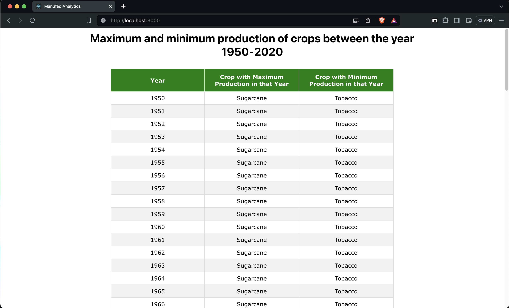
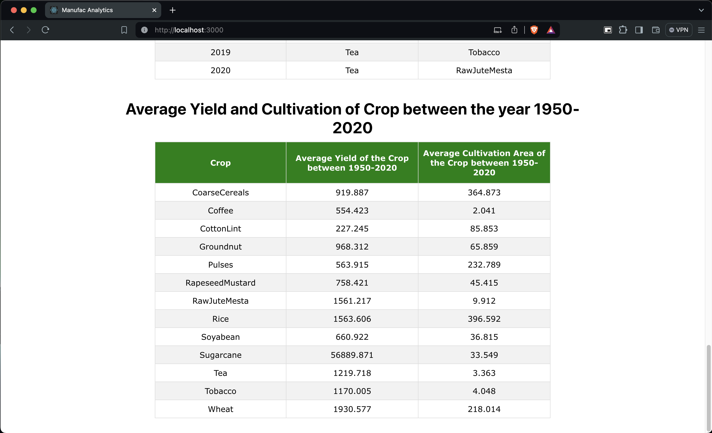

# Instructions - For starting and building the app

This project was bootstrapped with [Create React App](https://github.com/facebook/create-react-app) using [yarn](https://classic.yarnpkg.com/en/).

## Available Scripts

In the project directory, you can run:

### `yarn install`

Installs the node modules for the app from `package.json`
If you don't have yarn on your system then first install yarn

### `yarn start`

Runs the app in the development mode.\
Open [http://localhost:3000](http://localhost:3000) to view it in your browser.

## Screenshots:

### Maximum and Minimum production of the crops between year 1950-2020

### Average yield and Average cultivation of each crop between year 1950-2020

